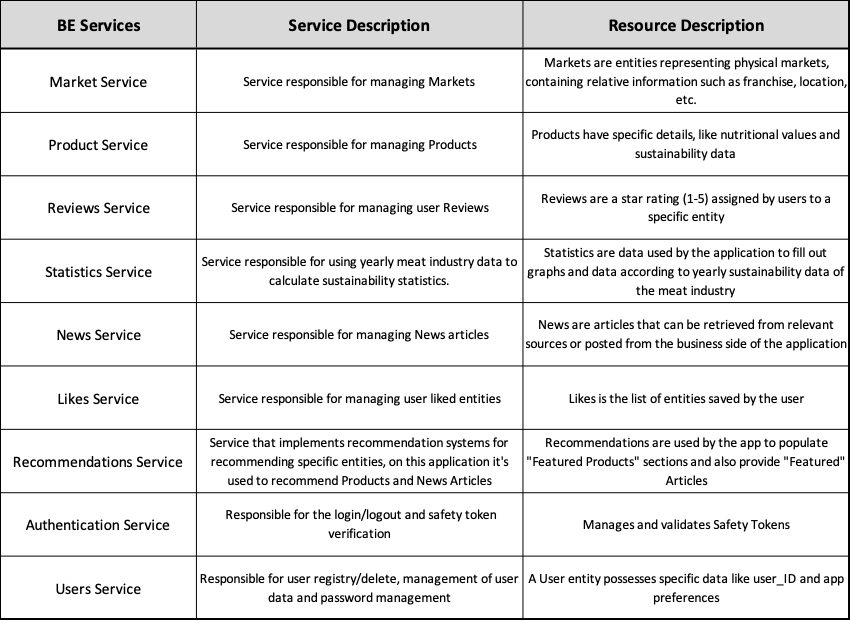

# The Backend Services

## Context

Our small team is developing a new meat related app called QR Meat that allows users to check on meat products and their related information like nutritional and sustainability values. We had to decided how to organize and devide the backend tasks into business oriented services so we could promote modularity, reusability, flexibility, testability and maintainability. We came up with a total of 9 services that proved crutial for the seamless function of the application. 

## Decision Drivers

- Dividing the overall app into business separated blocks, using decomposition by "Business Capabilities".
- Maximize the ability to change the backend services without affecting other business areas, promoting modularity, flexibility and maintainability.
- Facilitate testing by having development teams dedicated to specific business areas (services).
- Promote services reusability in other projects/applications aswell as selling them as a standalone solution for third-parties.

## Backend Services 
  - [Auth Service](auth-service.md)
  - [Likes Service](likes-service.md)
  - [Market Service](market-service.md)
  - [News Service](news-service.md)
  - [Product Service](product-service.md)
  - [Recommendations Service](recommendations-service.md)
  - [Reviews Service](reviews-service.md)
  - [Statistics Service](statistics-service.md)
  - [Users Service](users-service.md)

## Backend Services Table

## Backend Services Diagram

<p\>

<p\>

#### [Back to Front Page](../README.md)
