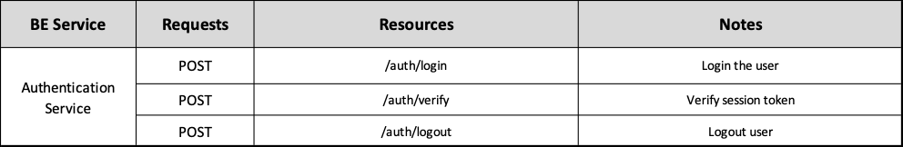

# Backend Authentication Service ADR

## Status

[Proposed]

## Context

The backend Authentication Service division, surged from the architectural principle of spliting the backend into business oriented services. 

## Description

This service is responsible for user authentication and safety tokens validation, aswell as validating tokens for other services.

## Resources

Manages and validates safety tokens.

## REST API

## Business Objects Interaction

