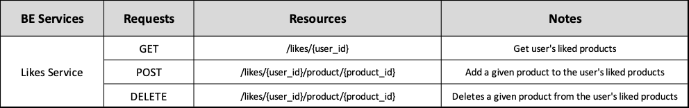

# Backend Likes Service ADR

## Status

[Proposed]

## Context

The backend Likes Service division, surged from the architectural principle of spliting the backend into business oriented services. 

## Description

This service is responsible for storing the saved entities (on this case Products) of a user in the for of likes

## Resources

Manages the list of entities (Products) saved by the user.

## REST API

## Business Objects Interaction

