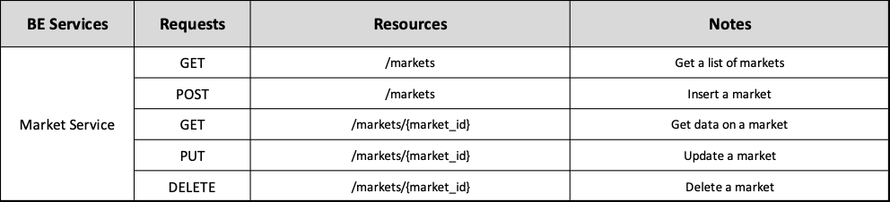
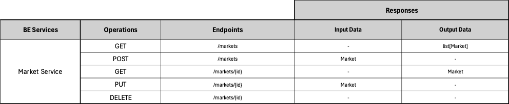

# Backend Market Service ADR

## Status

[Proposed]

## Context

The backend Market Service division, surged from the architectural principle of spliting the backend into business oriented services. 

## Description

This service is responsible for Markets and their associated data.

## Resources

Manages Markets, these are entities that represent physical markets containing relative information such as location, franchise, location, etc.

## REST API

## Business Objects Interaction

#### [Back to Backend Services](./README.md)
#### [Back to Backend](../README.md)
