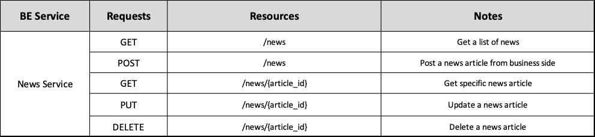

# Backend News Service ADR

## Status

[Proposed]

## Context

The backend News Service division, surged from the architectural principle of spliting the backend into business oriented services. 

## Description

This service is responsible for managing News Articles.

## Resources

Manages News Articles that can be retrieved from relevant sources or posted from the business side of the application.

## REST API

## Business Objects Interaction

