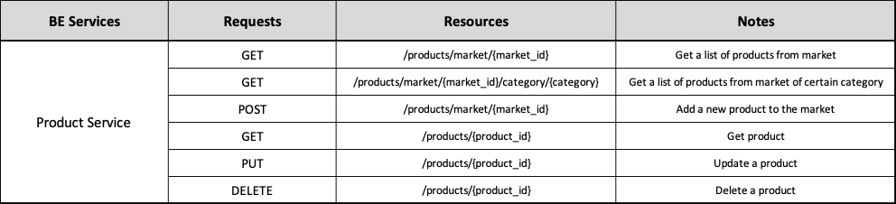
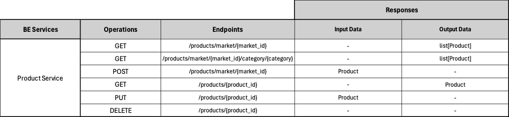

# Backend Product Service ADR

## Status

[Proposed]

## Context

The backend Product Service division, surged from the architectural principle of spliting the backend into business oriented services. 

## Description

This service is responsible for Products and their associated data.

## Resources

Manages Products and their specific details, like nutritional values and sustainability data.

## REST API

## Business Objects Interaction

#### [Back to Backend Services](./README.md)
#### [Back to Backend](../README.md)
