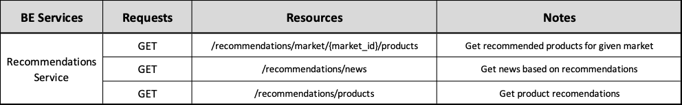
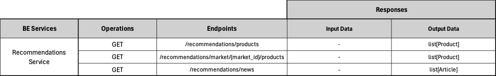

# Backend Recommendations Service ADR

## Status

[Proposed]

## Context

The backend Recommendations Service division, surged from the architectural principle of spliting the backend into business oriented services. 

## Description

This service implements recommendation systems for recommending specific entities, on this application it's used to recommend Products and News Articles.

## Resources

Recommendations are ...

## REST API

## Business Objects Interaction

#### [Back to Backend Services](./README.md)
#### [Back to Backend](../README.md)