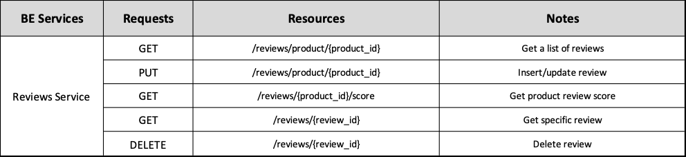
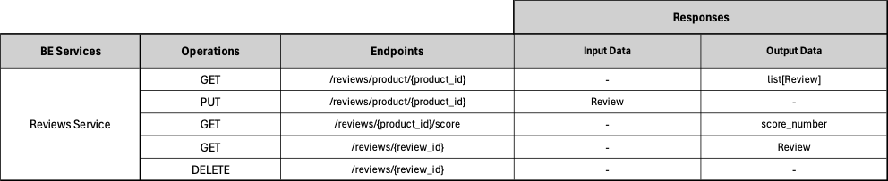

# Backend Reviews Service ADR

## Status

[Proposed]

## Context

The backend Reviews Service division, surged from the architectural principle of spliting the backend into business oriented services. 

## Description

This service is responsible for managing user Reviews.

## Resources

Reviews are a Star rating (1-5) assigned by users to a specific entity (Products on this case)

## REST API

## Business Objects Interaction

