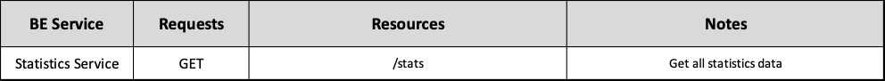
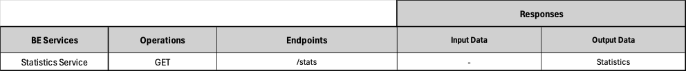

# Backend Statistics Service ADR

## Status

[Proposed]

## Context

The backend Statistics Service division, surged from the architectural principle of spliting the backend into business oriented services. 

## Description

This service is responsible for using yearly meat industry data to calculate sustainability statistics.

## Resources

Statistics are analytical data used by the application to fill out graphs and data according to yearly sustainability data of the meat industry.

## REST API

## Business Objects Interaction

