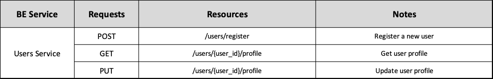
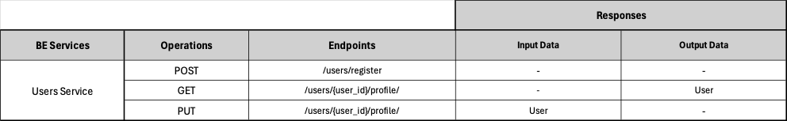

# Backend Users Service ADR

## Status

[Proposed]

## Context

The backend Users Service division, surged from the architectural principle of spliting the backend into business oriented services. 

## Description

This service is responsible for user registry/delete aswell as management of user data and password.

## Resources

Users are ...

## REST API

## Business Objects Interaction

