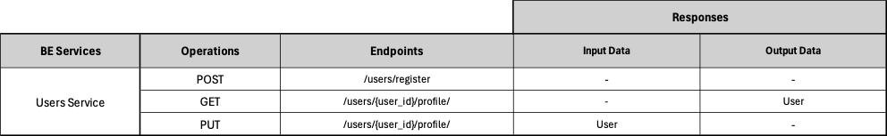

# Backend Users Service ADR

## Status

[Proposed]

## Context

The backend Users Service division, surged from the architectural principle of spliting the backend into business oriented services. 

## Description

This service is responsible for user registry/delete aswell as management of user data and password.

## Resources

Users are objects that hold user's data and activities within the application for example login credentials and session tokens.

## REST API

## Business Objects Interaction

#### [Back to Backend Services](./README.md)
#### [Back to Backend](../README.md)