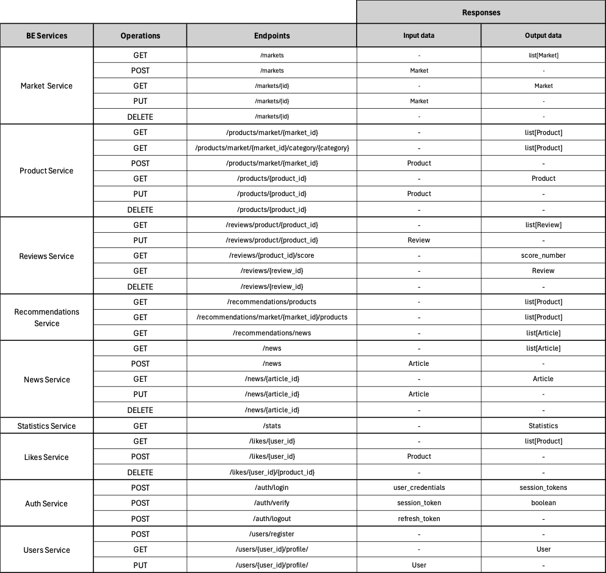

# Business Objects

Defining business objects is essential for web application development as it ensures a clear and structured representation of business logic. These objects encapsulate data and behaviours, promoting consistensy, maintainability and reusability across the application. Well-defined business objects ease integration with other systems and enhance testing by allowing isolated and efficient unit testing.

## Criteria

Defining the Business Objects (BOs) in web applications should focus on some specific criteria to ensure optimal design and functionality. The granularity of BOs should be as high-level as possible, encapsulating complex business logic eficiently and compactly. Simplicity is crucial, defining as few BOs as possible to avoid redundancy and maintain clarity. These objects must maintain data independance, functioning without relying on the front-end, and be modular, containing all necessary components for services. Readability should also be ensured as it makes BOs easily understandable by developers. 

## Business Objects 
Following the criteria described above we came up with 6 crucial Business Objects

- [Market]
- [Product]
- [Review]
- [Article]
- [Statistics]
- [User]

## Business Objects Table

The following table highlights the intereactions of Business Objects with Backend Services

<p\>

#### [Back to Front Page](../README.md)