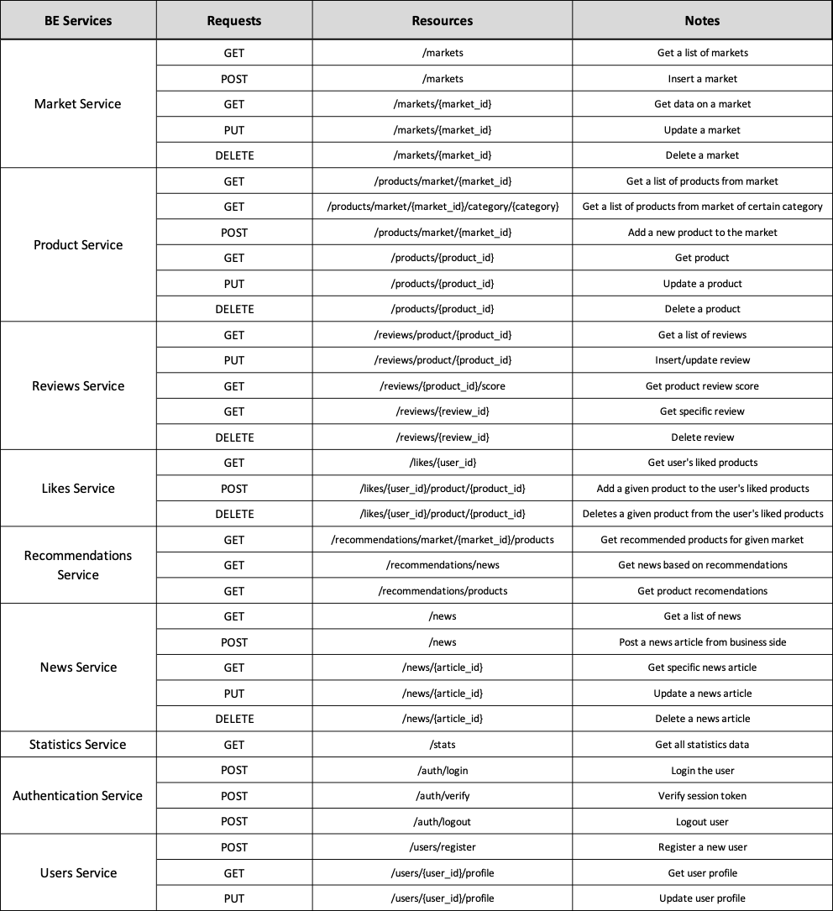

# Pragmatic REST

Pragmatic REST principles offer several advantages, particularly when it comes to enhancing developer experience and flexibility. They prioritize ease of use, providing intuitive APIs with clear and comprehensive endpoints, reducing the learning curve for developers. Overall, Pragmatic REST creates user-friendly, secure, and efficient APIs, well-suited for modern application development.

## Decision Drivers

- Single resource per Backend Service
- Cohesive set of requests
- All operations on a single resource
- Atomic operations, no saved context

## QRMeat RESTful APIs

- [Market Service API](MarketService-API.md)
- [Product Service API](ProductService-API.md)
- [Reviews Service API](ReviewsService-API.md)
- [Statistics Service API](StatisticsService-API.md)
- [News Service API](NewsService-API.md)
- [Likes Service API](LikesService-API.md)
- [Recommendations Service API](RecommendationsService-API.md)
- [Authentication Service API](AuthenticationService-API.md)
- [Users Service API](UsersService-API.md)

## Full Table APIs 

#### [Back to Backend](../README.md)

