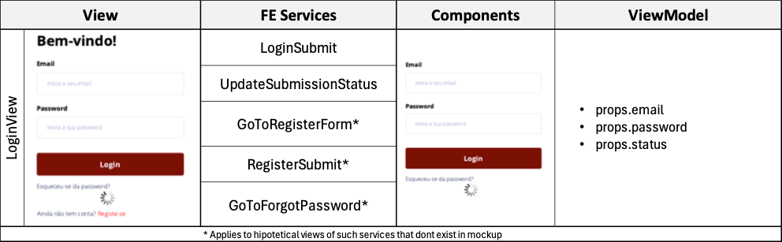
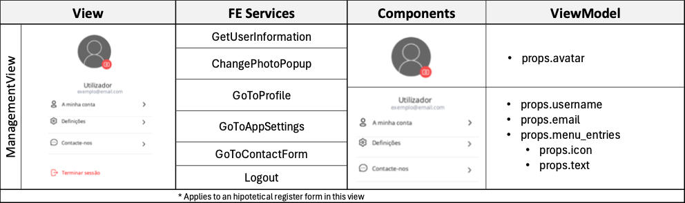

# Authentication Micro-Frontend ADR

## Status

[Proposed]

## Context and Problem Statement

Our small team is developing a new meat related app called QR Meat that allows to check on meat products and related information. We need to decide on how we are going to divide the in terms of Micro-frontends to ensure requirements such as modularity, reusability, flexibility, testability and maintainability.

## Decision Drivers

- Dividing the overall app into business separated blocks, using decomposition by "Business Capabilities".
- Ensure the ability to change the frontend without affecting other business areas, promoting modularity, flexibility and maintainability.
- Stimulate feature development having dedicated teams for specific business areas.
- Facilitate testing and deployment by isolating different components.
- Promote frontend component reusability in other projects or in selling as a standalone solution for third-parties.

## Decision Outcome

We decided based on the listed drivers to aggregate all the views, components and services related to user authentication, management and preferences under a single "Authentication Micro-Frontend". This way there will be a team dedicated to support and develop the features related with this frontend and this will promote specially flexibility, maintainability and reusability. This way Authentication related features can be reused in future projects or can be sold as a standalone solution for third-parties. Also important to mention, that this way the authentication system can be centralized/reused for all the "company" apps and services.

### Views, Components, FE Services

#### [Back to Frontend](../README.md)

