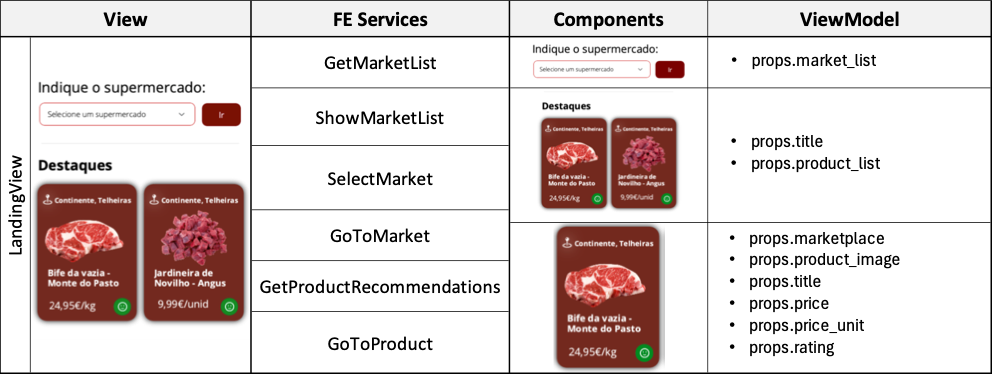
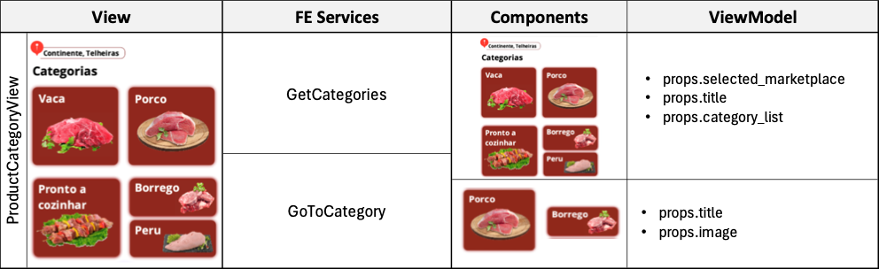
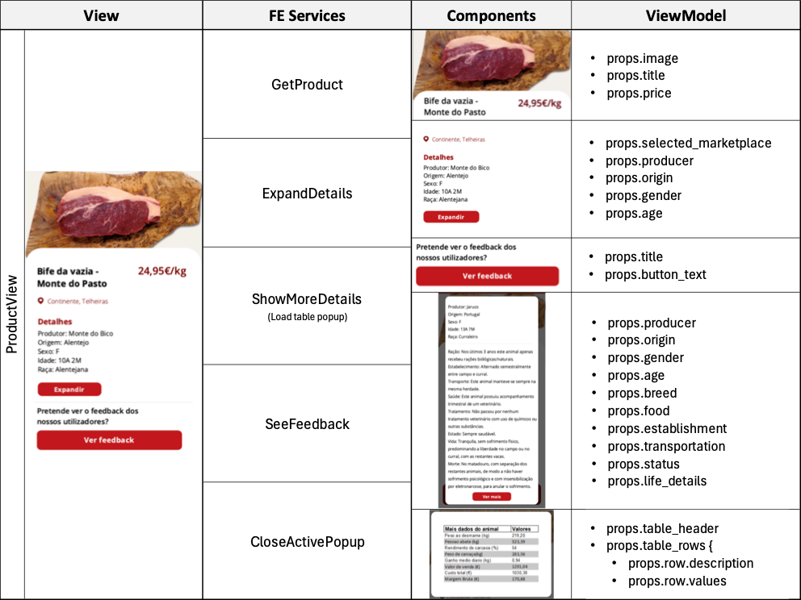
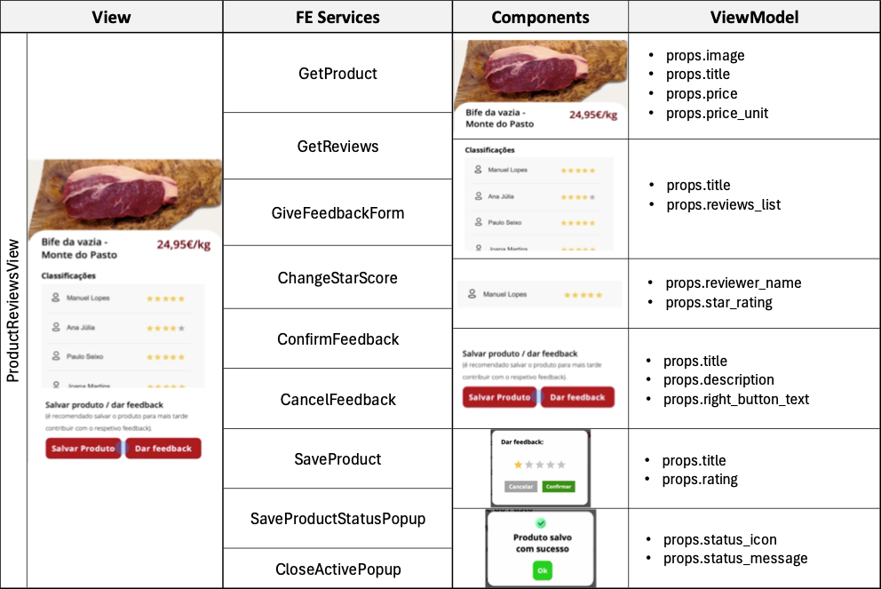
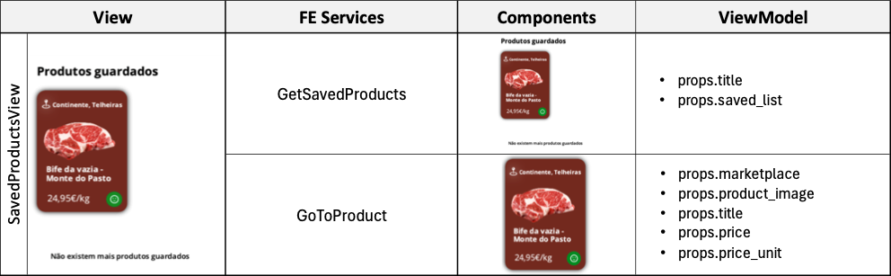

# Catalog Micro-Frontend ADR

## Status

[Proposed]

## Context and Problem Statement

Our small team is developing a new meat related app called QR Meat that allows to check on meat products and related information. We need to decide on how we are going to divide the app in terms of Micro-frontends to ensure requirements such as modularity, reusability, flexibility, testability and maintainability.

## Decision Drivers

- Dividing the overall app into business separated blocks, using decomposition by "Business Capabilities".
- Ensure the ability to change the frontend without affecting other business areas, promoting modularity, flexibility and maintainability.
- Stimulate feature development having dedicated teams for specific business areas.
- Facilitate testing and deployment by isolating different components.
- Promote frontend component reusability in other projects or in selling as a standalone solution for third-parties.

## Decision Outcome

We decided based on the listed drivers to aggregate all the views, components and services related to product catalog and supermarkets under a single "Catalog Micro-Frontend". This way there will be a team dedicated to support and develop the features related with this frontend and this will promote specially flexibility, maintainability and reusability. This micro-frontend  can be reused in future projects (related to other types of products, not meat) or can be sold as a standalone solution for third-parties.

## More Information

[More information paragraph if needed to say anythinh else.]

### Views, Components, FE Services

[More information on the Views, Components and FE Services, including tables, diagrams and other materials]

