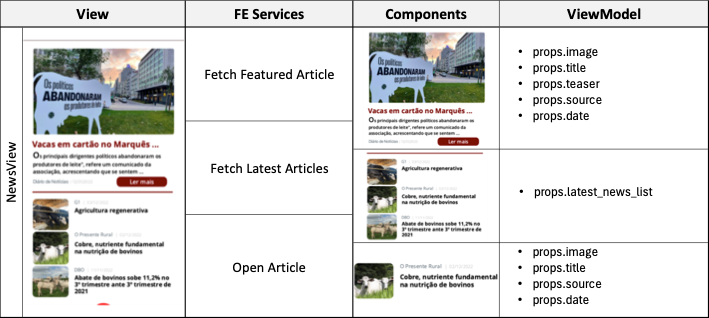
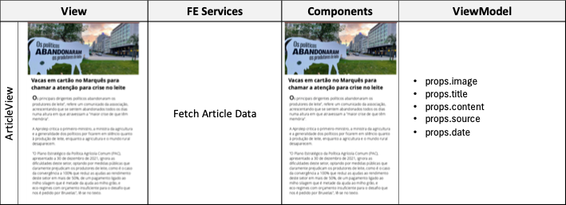
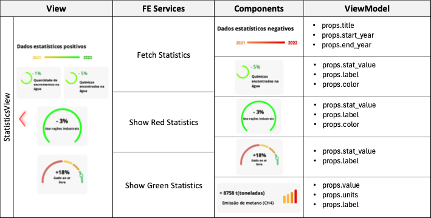

# News and Statistics Micro-Frontend ADR

## Status

[Proposed]

## Context and Problem Statement

Our small team is developing a new meat related app called QR Meat that allows to check on meat products and related information. We need to decide on how we are going to devide the in terms of Micro-frontends to ensure requirements such as modularity, reusability, flexibility, testability and maintainability.

## Decision Drivers

- Dividing the overall app into business separated blocks, using decomposition by "Business Capabilities".
- Ensure the hability to change the frontend without affecting other business areas, promoting modularity, flexibility and maintainability.
- Stimulate feature development having dedicated teams for specific business areas.
- Facilitate testing and deployment by isolating different components.
- Promote frontend component reusability in other projects or in selling as a standalone solution for third-parties.

## Decision Outcome

We decided based on the listed drivers to aggregate all the views, components and services related to news dissemination and statistic tracking under a single "News and Statistics Micro-Frontend". 

This side micro-frontend in the QR Meat works as a bonus feature for a small set of activist users that may be interested in getting in touch with the latest news related to meat. Because of this, having a team dedicated to support and develop the features in this business area is a good idea because this may result in a better functionality and value proposition in the future, while also promoting flexibility, maintainability and reusability. 

The feature can be reused in other applications where having news dissemination is needed, but for this bussiness capability as it is, we do not have a perspective of being a standalone solution.

## More Information

[More information paragraph if needed to say anythinh else.]

### Views, Components, FE Services

[More information on the Views, Components and FE Services, including tables, diagrams and other materials]

